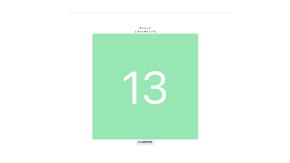

# FizzBuzz with React


## FizzBuzz ルーレット

スタート押して、止まったところの数字が 3 の倍数なら、Fizz、5 の倍数なら、Buzz、3 の倍数なら、15 の倍数なら、FizzBuzz と出力する



## 🎉 How to Play

スタート　：　画面のボタンを押す
ストップ　：　画面のボタンを押す

ストップしたタイミング数字もしくは文字列が表示される

## ⚙️ How to Build

```bash
npm i
npm run build
```

## ❗️ How to Run

```bash
npm run dev
```
